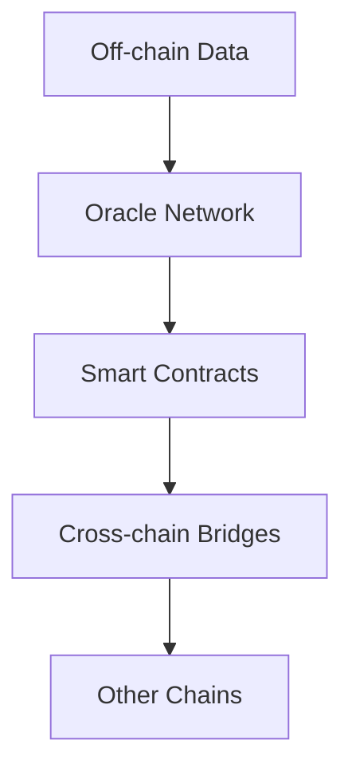

# Blockchain Architecture

## Overview

The blockchain layer provides integration with various blockchain networks, smart contract management, and cross-chain operations. It focuses on security, scalability, and interoperability.

## Components

### 1. Oracle Network

Components for providing off-chain data to smart contracts:

```
core/blockchain/oracles/
├── base.py           # Base oracle interface
├── providers/        # Data providers
├── validators/       # Node validators
└── aggregators/      # Data aggregators
```

#### Key Features
- Decentralized validation
- Data aggregation
- Stake management
- Dispute resolution

### 2. Smart Contracts

Contract templates and management:

```
core/blockchain/contracts/
├── base.py           # Base contract interface
├── prediction/       # Prediction market contracts
├── insurance/       # Insurance pool contracts
└── governance/      # DAO governance contracts
```

#### Contract Types
1. Prediction Markets
   - Market creation
   - Betting mechanisms
   - Settlement logic
   - Fee distribution

2. Insurance Pools
   - Risk assessment
   - Premium calculation
   - Claims processing
   - Pool management

3. Governance
   - Proposal submission
   - Voting mechanisms
   - Execution logic
   - Treasury management

### 3. Cross-chain Bridges

Components for cross-chain operations:

```
core/blockchain/bridges/
├── base.py           # Base bridge interface
├── assets/          # Asset bridge
├── data/           # Data bridge
└── execution/      # Cross-chain execution
```

## Architecture Flow



## Implementation Guidelines

### 1. Oracle Implementation
```python
class PredictionOracle(BaseOracle):
    async def validate_data(self, data):
        # 1. Check data format
        # 2. Verify sources
        # 3. Aggregate results
        # 4. Submit on-chain
```

### 2. Contract Implementation
```solidity
contract PredictionMarket {
    // State variables
    mapping(bytes32 => Market) public markets;
    
    // Market creation
    function createMarket(
        bytes32 question,
        uint256 endTime
    ) external {
        // Implementation
    }
    
    // Betting logic
    function placeBet(
        bytes32 marketId,
        bool prediction
    ) external payable {
        // Implementation
    }
}
```

### 3. Bridge Implementation
```python
class AssetBridge(BaseBridge):
    async def transfer_assets(self, params):
        # 1. Lock assets
        # 2. Generate proof
        # 3. Cross-chain message
        # 4. Verify and release
```

## Configuration

Example blockchain configuration:
```yaml
blockchain:
  networks:
    ethereum:
      rpc_url: "https://mainnet.infura.io/v3/${INFURA_KEY}"
      chain_id: 1
      
    polygon:
      rpc_url: "https://polygon-rpc.com"
      chain_id: 137
      
  contracts:
    prediction_market:
      address: "0x..."
      version: "1.0"
      
    insurance_pool:
      address: "0x..."
      version: "1.0"
```

## Security Considerations

1. **Smart Contract Security**
   - Formal verification
   - Audit requirements
   - Upgrade mechanisms
   - Emergency stops

2. **Oracle Security**
   - Sybil resistance
   - Stake slashing
   - Data validation
   - Timeout handling

3. **Bridge Security**
   - Multi-sig control
   - Proof verification
   - Asset locking
   - Emergency procedures

## Gas Optimization

1. **Contract Optimization**
   - Storage patterns
   - Batch operations
   - Gas limits
   - Proxy patterns

2. **Transaction Management**
   - Gas estimation
   - Nonce management
   - Priority fees
   - Transaction batching

## Monitoring and Maintenance

1. **Contract Monitoring**
   - Event logging
   - State monitoring
   - Gas usage
   - Error tracking

2. **Network Monitoring**
   - Node health
   - Network congestion
   - Fork detection
   - Reorg handling

3. **Bridge Monitoring**
   - Asset balances
   - Message queues
   - Proof verification
   - Error recovery

## Deployment Strategy

1. **Contract Deployment**
   - Test networks
   - Mainnet deployment
   - Proxy upgrades
   - State migration

2. **Oracle Network**
   - Node distribution
   - Stake requirements
   - Validator selection
   - Network growth

3. **Bridge Network**
   - Chain selection
   - Liquidity provision
   - Security parameters
   - Scaling strategy 