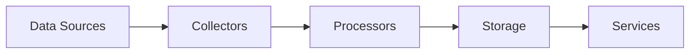

# Data Architecture

## Overview

The data layer is responsible for collecting, processing, and storing multimodal data from various sources. It follows a pipeline architecture with three main components:

## Components

### 1. Data Collectors

Data collectors are responsible for gathering data from different sources:

```
core/data/collectors/
├── base.py           # Base collector interface
├── social/           # Social media collectors
├── news/            # News API collectors
└── blockchain/      # Blockchain data collectors
```

#### Key Features
- Asynchronous data collection
- Rate limiting and throttling
- Error handling and retry mechanisms
- Source-specific authentication

### 2. Data Processors

Processors handle data transformation and enrichment:

```
core/data/processors/
├── base.py           # Base processor interface
├── text/            # Text processing
├── image/           # Image processing
└── pipeline/        # Processing pipeline
```

#### Processing Pipeline
1. Raw data ingestion
2. Data cleaning and normalization
3. Feature extraction
4. Sentiment analysis
5. Entity recognition
6. Data enrichment

### 3. Data Storage

Storage interfaces for different data types:

```
core/data/storage/
├── base.py           # Base storage interface
├── timeseries/      # Time-series data
├── document/        # Document storage
└── cache/           # Caching layer
```

## Data Flow



## Implementation Guidelines

### 1. Collector Implementation
```python
class TwitterCollector(BaseCollector):
    async def collect(self):
        # 1. Authenticate with Twitter API
        # 2. Stream relevant data
        # 3. Parse and validate
        # 4. Return structured data
```

### 2. Processor Implementation
```python
class SentimentProcessor(BaseProcessor):
    async def process(self, data):
        # 1. Clean text data
        # 2. Apply sentiment analysis
        # 3. Normalize scores
        # 4. Return enriched data
```

### 3. Storage Implementation
```python
class TimeSeriesStorage(BaseStorage):
    async def store(self, data):
        # 1. Validate data format
        # 2. Apply compression if needed
        # 3. Store with timestamp
        # 4. Update indices
```

## Configuration

Example configuration structure:
```yaml
collectors:
  twitter:
    api_key: ${TWITTER_API_KEY}
    max_requests_per_minute: 60
    
processors:
  sentiment:
    model: "distilbert-base-uncased"
    batch_size: 32
    
storage:
  timeseries:
    retention_days: 30
    compression: true
```

## Error Handling

1. **Collection Errors**
   - API rate limits
   - Network timeouts
   - Authentication failures

2. **Processing Errors**
   - Invalid data format
   - Model inference errors
   - Resource constraints

3. **Storage Errors**
   - Disk space issues
   - Connection failures
   - Consistency errors

## Monitoring

Key metrics to track:
- Collection success rate
- Processing latency
- Storage utilization
- Error rates by type
- Data quality metrics

## Security Considerations

1. **Data Privacy**
   - PII handling
   - Data encryption
   - Access control

2. **API Security**
   - Key rotation
   - Request signing
   - Rate limiting

3. **Storage Security**
   - Encryption at rest
   - Backup strategy
   - Access logs 