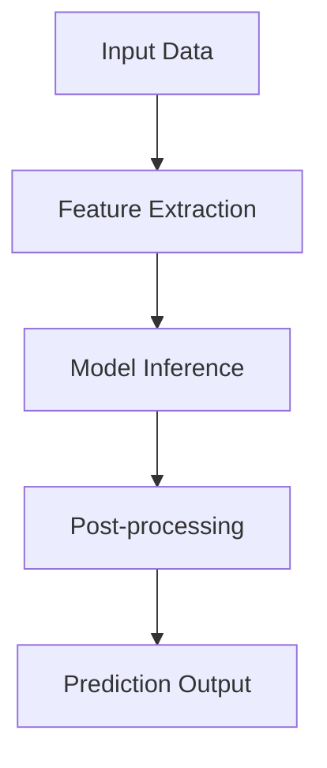

# Model Architecture

## Overview

The model layer implements AI/ML models for multimodal analysis, risk assessment, and anomaly detection. It follows a modular architecture that supports multiple model types and inference patterns.

## Components

### 1. Multimodal Models

Models for processing different types of data:

```
core/models/multimodal/
├── base.py           # Base multimodal model
├── text/            # Text analysis models
├── image/           # Image analysis models
└── fusion/          # Multimodal fusion models
```

#### Key Features
- Text sentiment analysis
- Image feature extraction
- Cross-modal attention
- Feature fusion

### 2. Risk Models

Models for risk assessment and prediction:

```
core/models/risk/
├── base.py           # Base risk model
├── volatility/       # Volatility prediction
├── correlation/      # Asset correlation
└── portfolio/       # Portfolio optimization
```

#### Risk Analysis Pipeline
1. Historical data analysis
2. Feature engineering
3. Risk factor modeling
4. Scenario analysis
5. Portfolio optimization

### 3. Anomaly Detection

Models for detecting abnormal patterns:

```
core/models/anomaly/
├── base.py           # Base anomaly model
├── statistical/      # Statistical methods
├── deep/            # Deep learning methods
└── ensemble/        # Ensemble methods
```

## Model Flow



## Implementation Guidelines

### 1. Model Loading
```python
class SentimentModel(BaseModel):
    async def load(self):
        # 1. Load model weights
        # 2. Initialize tokenizer
        # 3. Move to correct device
        # 4. Warm-up inference
```

### 2. Inference Pipeline
```python
class RiskModel(BaseModel):
    async def predict(self, data):
        # 1. Preprocess input
        # 2. Batch processing
        # 3. Model inference
        # 4. Post-processing
```

### 3. Model Management
```python
class ModelManager:
    async def get_model(self, model_type):
        # 1. Check cache
        # 2. Load if needed
        # 3. Version control
        # 4. Return model
```

## Configuration

Example model configuration:
```yaml
models:
  sentiment:
    name: "finbert"
    version: "1.0"
    batch_size: 32
    device: "cuda"
    
  risk:
    type: "portfolio"
    window_size: 100
    factors: ["momentum", "volatility"]
    
  anomaly:
    algorithm: "isolation_forest"
    contamination: 0.1
```

## Performance Optimization

1. **Inference Optimization**
   - Batch processing
   - Model quantization
   - GPU utilization
   - Caching

2. **Memory Management**
   - Model sharing
   - Lazy loading
   - Resource cleanup

3. **Scaling Strategies**
   - Model parallelism
   - Data parallelism
   - Distributed inference

## Model Evaluation

Key metrics to track:
- Inference latency
- Memory usage
- Prediction accuracy
- Model drift
- Resource utilization

## Model Security

1. **Input Validation**
   - Data sanitization
   - Size limits
   - Format verification

2. **Model Protection**
   - Weight encryption
   - Access control
   - Version control

3. **Output Safety**
   - Confidence thresholds
   - Output validation
   - Error handling

## Model Deployment

1. **Versioning**
   - Model versioning
   - Weight versioning
   - Config versioning

2. **Deployment Strategies**
   - Blue-green deployment
   - Canary releases
   - A/B testing

3. **Monitoring**
   - Performance metrics
   - Error rates
   - Resource usage 